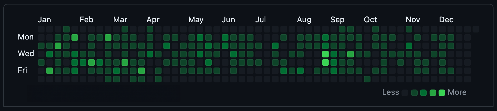

# Hello, I'm Soma! 👋

  

## 🚀 About Me

I'm a passionate Fullstack Software Engineer with a knack for solving complex problems and building scalable software solutions. With a background in Mathematics & Software Engineering I've honed my skills in languages like Java, C#, Matlab, Python, Node.js, TypeScript with most-wanted technologies like React, Cloud Computing, MERN Stack, JAM Stack, Microservices architecture etc. I am always eager to learn more and take on new challenges.

In addition to my technical expertise, I hold a Diploma in Typography, where I've explored the intersection of text and technology, enhancing user experiences and interface design. This unique combination of skills enables me to contribute from the database to the frontend, from system design to user experience and aesthetics.

My journey has also led me to the classroom, where I've shared my knowledge by teaching mathematics and software engineering. This experience has sharpened my ability to break down complex concepts into understandable chunks, a skill that benefits not just my students but also my colleagues and stakeholders in professional settings.

Leadership and collaboration are at the core of my professional ethos. As tech lead in several teams, I leveraged agile methodologies to drive productivity and foster an environment of open communication and mutual respect.

With a multifaceted skill set that spans technical development, design principles, educational proficiency, and team management, I'm excited about the opportunities to contribute to innovative projects and collaborate with forward-thinking teams.

- 🌱 I’m currently learning: machine learning for image recognition problems, CI/CD, cloud computing, German language, system design, opportunities of using LLM in software development, product management, Augmented Reality development with Unity
- 💡 I love innovation and new technologies.
- 🎯 I’m focusing on building new projects from scratch
- 🤝 I’m looking for help on typography and vector graphics problems: train models on typeface recognition, recognizing layout patterns, creating new typefaces with code, analyzing type shapes with code to identify characteristics.

## 🛠 Skills

- **Management:** Agile Methodologies, Scrum, Kanban, mentoring
- **Mathematics:** Linear Algebra, Calculus, Probability & Statistics
- **Languages:** Python, JavaScript, TypeScript, Java, C#, MATLAB
- **Frameworks / Libraries:** React, Node.js, Express, Vue.js, .NET, Spring Boot
- **Tools & Technologies:** Git, Docker, AWS, CI/CD
- **Databases:** MongoDB, PostgreSQL, GraphQL

## 💼 Projects

I am proud of working on **General Electric**'s [First Pass Yield project](https://youtu.be/8zS5vb8QdP0?si=bp3iEeu2MHfnbs8c). My team automated the process of data collection and analysis on the shop floor, making the quality control process of turbine blades more efficient and accurate. This project was followed by others, saving the company hundreds of thousands of dollars.

As developer at **IX** (Epam) I created Business Intelligence dashboards for the company's clients Procter & Gamble and Under Armour. The dashboards were built using Tableau, Power BI and Spotfire, and provided insights on sales, marketing, and customer behavior. This was essential for the companies to make data-driven decisions and to optimize their business strategies.

In **Linearity / Vectornator** I worked on the development of Linearity Curve's backend infrastructure. Providing a robust API for the app's features, I helped the team to scale the app and to improve its performance.

In **Wineconx** I worked on smart social media marketing tools. I mentored junior colleagues, introducing new technologies and best practices, while I was also the one who comes up with new feature ideas, implementing the basics and then guiding the team to contribute.

## 📈 Stats on 2023 contributions

## 📫 Let's Connect

- **LinkedIn:** [Soma Hargitai LinkedIn](https://www.linkedin.com/in/somahargitai/)
